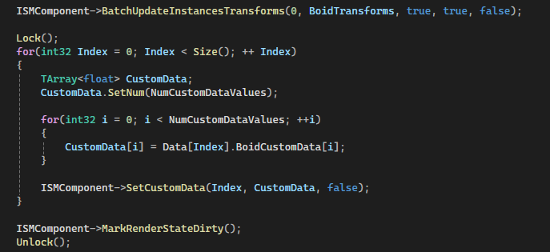

# 1. Introduction
**REDUCED TO RUBBLE (R2R)** is a fast-paced action-arcade game where players control a massive robot to cause destruction and chaos in a destructible environment. The primary objective is to rack up high scores by destroying as much as possible within a time limit, combining elements of action, simulation, and destruction for a thrilling experience. The game aims to appeal to both casual players looking for quick fun and highscore chasers who enjoy mastering challenges and pushing their limits.
In this prototype, I will present the team's perspective on the current state, implemented features, and the development plan for the next three weeks in chapters 2, 3, and 6. In chapters 4 and 5, which focus on technical challenges and current limitations, I will cover only my personal contributions.
# 2. Current State
The image is from the first version of **REDUCED TO RUBBLE (R2R)**. In this new project, we are developing a more intense second version with more NPCs, more objective types, more power-ups, and even more spectacular destruction effects.

We have completed the initial design as originally planned, implementing basic player control functions (including climbing, running, and jumping), building destruction, and civilian NPCs along with the directive system. 
Building on this, we conducted testing and gathered player feedback, leading to a second round of design and development. This includes, but is not limited to, the addition of throwable objects and traps, combo mechanics, tanks, police, army functionalities, and the integration of more elements such as health bars.
# 3. Implemented Features
## 3.1 Level
We have completed the experimental level, and based on that, Curtis has started developing our first level map, which is modeled after the city of Wellington.

## 3.2 Character
The player model and animations are being implemented by Drake. The model creation and basic run, jump, and car transformation animations have been completed, and more animations are currently in progress, such as backflip and victory.

https://github.com/user-attachments/assets/0b266ade-6d10-4182-9b2d-4ff776c3630b

https://github.com/user-attachments/assets/4944ce9c-4b53-45f1-a782-06e3bb629847

Currently, the NPCs are designed with various functionalities, including civilians, polices, and tanks.
## 3.3 Building
Based on the static building models, Kent used the Fracture mode to fragment the shell of each building, thereby achieving the destruction effect.

## 3.4 Directive System
Ocean completed the UI and Directive System, set up the DataTable, and implemented features such as creating directives, completing directives, and adding scores.

## 3.5 NPC - Civilian
The initial civilian AI was developed by Dennis, but due to performance bottlenecks—we aimed to have tens of thousands of civilians on the screen simultaneously—the task was handed over to Iris for completion.
Iris (I) has implemented the civilian functionality, which includes basic movement such as obstacle avoidance and player evasion, damage handling, and a timed spawn system.

https://github.com/user-attachments/assets/0b1e8e6a-7800-4e69-924c-d093d7209eae

# 4. Technical Challenges and Solutions
The technical challenges of the Civilian task can be divided into three main parts: 
1. Rendering tens of thousands of civilians on screen, 
2. AI logic (obstacle avoidance and fleeing from the player), and 
3. Detecting damage range and removing the corresponding civilians.
## 4.1 Rendering
Before taking on this task, I conducted some research and explored potential technical solutions:
1. Niagara Crowds (Reference: [Creating Ambient Birds in Unreal with Niagara and Vertex Animations](https://www.chrismccole.com/blog/creating-ambient-birds-in-unreal-with-niagara-and-vertex-animations))
2. Instanced Static Mesh (Reference: [Unreal Engine 5 Tutorial - Instanced Static Meshes - ISM/HISM](https://www.youtube.com/watch?v=cfR36FTbvcQ))
3. Mass Entity (Reference: [Large Numbers of Entities with Mass in UE5 | Feature Highlight | State of Unreal 2022](https://www.youtube.com/watch?v=f9q8A-9DvPo&t=219s))
After comparing the implementation complexity and the project requirements for interactive civilians, I chose the second option.

At the same time, I'm also considering including Niagara as a solution for damage effects performance optimization in our future development plan.
## 4.2 AI Logic
Additionally, based on the Instanced Static Mesh, I further implemented some AI logic features, such as avoiding building obstacles and fleeing from the player.
### 4.2.1 Avoiding Obstacles
For the obstacle avoidance part, I consulted Dr. Simon and implemented two different effects using the NavMesh and LineTrace approaches.

https://github.com/user-attachments/assets/9aaa0a11-4132-48c0-b95e-d1c9d39b183d

https://github.com/user-attachments/assets/0aeb8b7b-c6ff-41a4-b065-29f58c02012d

At the same time, I compared the CPU overhead of the two different methods. With 10,000 densely packed civilians, the CPU overhead for NavMesh is around 9ms, while for LineTrace, it's around 50ms.

I ultimately used the NavMesh approach to implement the obstacle avoidance functionality. The LineTrace method calls the `TSceneCastCommonImpWithRetryRequest` function in the underlying Physics module, while the NavMesh approach uses pre-cached `NavigationData` with the `ProjectPoint` method. As a result, NavMesh is significantly more efficient than LineTrace in terms of performance.
### 4.2.2 Fleeing Player
For the logic of fleeing from the player, I used a **SphereZone**. While updating the civilians' positions in parallel using **ParallelFor**, I calculate the current position of each civilian relative to the position and radius of the SphereZone. If the civilian is within the range, a force in the opposite direction is applied to it.

https://github.com/user-attachments/assets/a1b82407-025d-4e9f-9d26-39cfcddf6c1c

## 4.3 Detecting Damage
The damage logic is divided into four stages:
1. A damage detection function is defined in C++, similar to the **FleePlayer** logic. It also uses **ParallelFor** to check the relationship between position and radius to determine if civilians are within the damage range, ultimately returning a vector of civilians in the damage zone.
2. The damage detection C++ function is called within the **Tick** event in Blueprints. Then, using the **ForEach** function, each civilian is iterated over, and a C++ function is called to apply damage to each civilian and remove them.
3. At each civilian's death location, a Blueprint function is called to increase the score and display UI effects.
4. At each civilian's death location, a **ParticleSystem** is created to display blood effects.

https://github.com/user-attachments/assets/fbd9c7de-986c-4f95-9df0-469f92f10e11

# 5. Current Limitations
## 5.1 Frame Drop
Although the game requirements have been initially implemented, there is a noticeable frame drop when executing the damage logic, especially when the civilians are densely packed.
Here’s an example of an extreme case where the speed is 0:

https://github.com/user-attachments/assets/b2214417-6f6e-40c2-b620-9955629807b4

## 5.2 Asnyc Task on Main Thread
Although the NavMesh method for Avoid Obstacle offers significant performance improvements over LineTrace, both methods still suffer from limited parallelism. This is because `ProjectPointToNavigation` and `LineTraceSingleByChannel` must be executed on the main thread, which greatly hampers the overall parallel processing efficiency.

# 6. Future Development Plan
## 6.1 More Throwable Objects
In the next version, we plan to develop more throwable objects that produce various effects, such as black holes, lightning, and fire.

## 6.2 More NPCs
Tanks and police are currently in development.

https://github.com/user-attachments/assets/65743576-e971-4570-99b6-e54829a6c7fb

## 6.3 Performance Optimazation
As mentioned earlier in the **Current Limitations**, I have started using **Insights** to conduct some preliminary performance analysis to address the emerging performance bottlenecks.
Based on the preliminary analysis, and in conjunction with the damage steps discussed in the **Detecting Damage** section, the additional 450ms overhead in **Slate::Tick** can be attributed to the score UI for each civilian. We plan to no longer create a separate UI score for each individual civilian, but instead display a single score UI for each batch of damage dealt.

Additionally, since the damage logic is currently executed by Blueprints using the **ForEach** method, which can only run on the main thread, it significantly increases the performance overhead. To optimize this part, I plan to move the code to a C++ function and attempt to handle the damage logic on a background thread.

Lastly, for the particle effects, I plan to reference the **Niagara Crowds** method mentioned earlier in the **Rendering** section. For each batch of civilians taking damage, I will create a single Niagara system and sync the positions of the deceased civilians to the emitter during the **Particle Update** phase. If performance bottlenecks persist, I will consider using an **Object Pool** approach to maintain a resource pool.
In addition to the issues already identified, we plan to continuously track and optimize the overall functionality of the project for performance.
